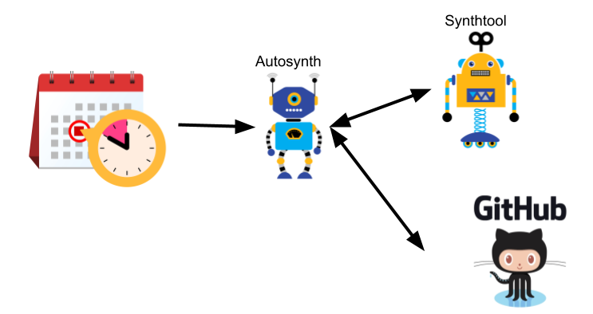

# Automated Synthesis of Client Libraries



On a regular schedule, at least once per day, a job automatically
re-synthesize all the source code for all the client libraries in 
http://github.com/googleapis.  That way, changes to API definitions
in [googleapis/googleapis](http://github.com/googleapis/googleapis) are
quickly propagated to client libraries.

The tool that regenerates the source code is [../synthtool](../synthtool).
The tool that automatically runs synthool on a regular schedule is
**autosynth** and updates github with the changes is github.

The configuration for the periodic jobs lives in
[../.kokoro-autosynth](../.kokoro-autosynth).

# Running autosynth manually

To manually regenerate a library, run [../synthtool](../synthtool), not
autosynth.

Running autosynth locally may be useful to debug a misbehaving autosynth,
but this author sees no other purpose to running it manually.  In all other
cases, running [../synthtool](../synthtool) is the easier option.

1. **Export environment variables with your github credentials.**

    Set the environment variables
    ```
    export GITHUB_USER=<your-github-handle>
    export GITHUB_EMAIL=<your-github-email>
    export GITHUB_TOKEN=<your-github-token>
    ```

2. **Configure the git command line to use your github credentials.**
    
    Use the [`git config --global credential.helper`](https://git-scm.com/book/en/v2/Git-Tools-Credential-Storage) command to install
    your credentials.

3. **Configure context-aware commits.**
    To enable [context aware commits](../synthtool#context-aware-commits),
    set the environment variables
    ```
    export AUTOSYNTH_MULTIPLE_COMMITS="True"
    export AUTOSYNTH_MULTIPLE_PRS="True"
    ```

4. **Run autosynth**

    Example:
    ```
    python3 -m autosynth.synth --repository=googleapis/java-asset
    ```
    will resynthesize the source code in
    https://github.com/googleapis/java-asset, and create a pull request
    if the generated code differs.
